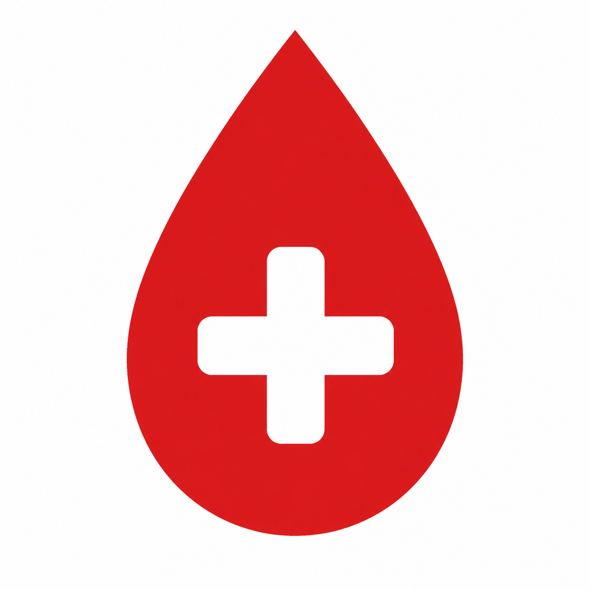
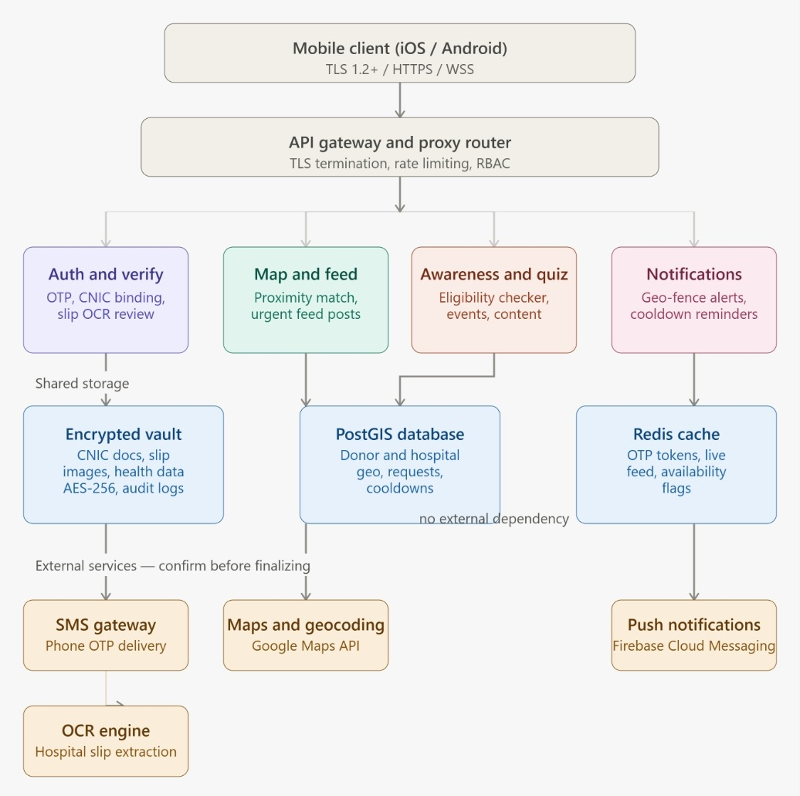

<p align="center">
  
</p>

<h1 align="center">QATRA</h1>
<p align="center"><em>Connecting Verified Seekers to Eligible Donors — in Minutes, Not Hours</em></p>

<p align="center">
  
  
  
</p>

---

## About

QATRA (formerly documented as the **Emergency Blood Response Platform**) is a project built for **Alkhidmat Foundation Pakistan**, aimed at replacing the informal WhatsApp-broadcast model of emergency blood requests with a structured, verified, and fast digital system.

When a patient urgently needs blood, families currently forward WhatsApp messages across group chats — a process that loses context, arrives too late, and offers no way to verify whether a request is even real. QATRA connects three groups that today operate through disconnected, informal channels:

* **Emergency blood seekers** — patients' families and hospital staff
* **Verified donors** — pre-screened and eligibility-tracked
* **Campus \& community drive organizers** — running Alkhidmat's donor pipelines

**Version 1.0 goal:** verified request in → matched, eligible donor out, in under 15 minutes. Scoped to Karachi trauma centers and Alkhidmat's existing campus chapters.

## Core Problems Addressed

* **Emergency search bottlenecks** — WhatsApp chains cause hours of delay and duplicated/contradictory information exactly when speed matters most.
* **Donor trust \& verification gaps** — no reliable way to tell a legitimate hospital request from a scam or commercial reseller.
* **Social \& cultural awareness barriers** — myths about donor eligibility and unfamiliarity with the process shrink the usable donor pool.

## Key Features

|Module|Description|
|-|-|
|**Live Map \& Proximity Matching**|Plots verified requests at hospital coordinates; geo-fenced dispatch to eligible donors within a configurable radius (5/10/15 km), with auto-expansion if too few donors respond.|
|**Auth, Verification \& Eligibility**|Phone OTP + CNIC identity binding, hospital-slip OCR verification with admin review queue, 90-day donor cooldown tracking, and a 4-step pre-screening health checklist.|
|**Social Feed**|Structured, filterable posts replacing WhatsApp spam — filter by blood group, urgency, and location, with one-tap "I Can Donate" response.|
|**Awareness \& Eligibility Module**|Educational content library, myth-busting resources, an interactive eligibility checker, and campus/community blood drive registration with QR check-in.|

## Project Goals

1. Reduce emergency search-to-connection time to under **15 minutes** for urgent requests.
2. Ensure **100%** of live requests are verified via hospital admission slip + CNIC before broadcast.
3. Maintain a pre-screened, cooldown-tracked donor pool to eliminate avoidable on-site drive disqualifications.
4. Give community/campus drive leads a centralized tool to run their own blood drives.

**Out of scope for V1:** physical blood delivery/logistics, any paid or commercial blood transactions, direct hospital EMR integration, and geographic expansion beyond Karachi.

## System Architecture

QATRA follows a modular architecture: a mobile client communicates through an API gateway to four core backend modules — **Auth \& Verify**, **Map \& Feed**, **Awareness \& Quiz**, and **Notifications** — each backed by shared storage (encrypted vault, geo-indexed database, cache layer) and calling external services (SMS OTP delivery, OCR extraction, maps/geocoding, push notifications) where relevant.

<p align="center">
  
</p>

> The full architecture breakdown is also documented in \[`docs/PRD.pdf`](docs/PRD.pdf) (Section 8), and is being finalized pending external-service vendor confirmation.

## Repository Structure

```
QATRA/
├── docs/
│   ├── PRD.pdf            # Full Project Requirement Document
│   └── Wireframes.pdf     # Seeker, Donor & Admin journey wireframes (22 screens)
├── media/
│   └── logo.png           # App logo
└── README.md
```

## Documentation

* 📄 [**Project Requirement Document**](docs/PRD.pdf) — goals, personas, functional requirements per module, non-functional requirements \& KPIs, and system architecture
* 🎨 [**Wireframes**](docs/Wireframes.pdf) — complete UI wireframes across the Seeker (10 screens), Donor (8 screens), and Admin/Verification Desk (4 screens) journeys

## Team

Built by a 6-member group for the Alkhidmat Foundation Pakistan IT internship:

|Role|Member|
|-|-|
|Live Map \& Proximity Matching|Hareem Israr|
|Auth, Verification \& Eligibility|Saghir Ahmed|
|Social Feed|Mahrukh Baig|
|Awareness \& Eligibility Module|Yumna Abbasi|
|Non-Functional Requirements \& KPIs|Nimra Iftikhar|
|Team Lead / Architecture|Abdul Hayy Khan|

## Status

This repository currently holds project documentation (PRD, wireframes, branding). Implementation has not started yet — this README will be updated with setup instructions, tech stack, and build steps once development begins.


## 📄 License

This project is open-source and available for educational and commercial use under the MIT License.

---

**Made with ❤️ by** [**Abdul Hayy Khan**](https://www.linkedin.com/in/abdulhayykhan/)

